# Deployment Guide — Order Acknowledgment Custom Email Message (SA 53475)

> **Status (2026-08-31): deployed + verified in P21Play, Prod plan pending.** See the `## 2026-08-26` section below. Sections written before that date (Artifact(s), Target environments, Deploy steps) still describe the pre-deployment "blocked on Matt / nothing in Play" state and need a fuller reconciliation pass — trust the dated sections.

> Produced during development. Update as the artifact changes; commit with the code.

## Artifact(s)
- `CSharp\asi_oe_email_close_diag.cs` — **confirmed-working design, fully proven, plain text only**: an On-Demand rule attached directly to the OK button (`cb_ok`) on window `w_email_response`, appending to `memo` via `Data.Set` (multi-row) *after* the user's own comments. Both open diagnostic questions are now closed (2026-07-30): `memo` does not render HTML (tag came through literal), and image attachment/embedding is a confirmed dead end that can crash the P21 client (see Backward-compatibility notes). **The real (non-diagnostic) production rule based on this design has not been built yet** — blocked on Matt Munson for (1) which database to use for UAT and (2) the exact Marketing text — this file still writes a test marker, not the intended message.
- `CSharp\asi_oe_order_ack_custom_message_t3.cs` — On-Event rule on `FormPreEmail`, pre-fills blank lines + message before the window opens. Built, never registered/tested. Now a documented **fallback only**, not the primary plan.
- Superseded: `asi_oe_order_ack_custom_message_t1.cs` (caused a live-customer incident — see below, do not reuse), `asi_oe_order_ack_custom_message_t2.cs` (confirmed working, still the only `_tN`-family version actually registered)
- Ticket: SA 53475 (assigned 2026-08-26; the 2026-07/08 development work predates it)

## Target environments
- **P21 Business Rules** (mgoldyn's own testing) → **Play** (user-facing testing) → Prod
- **Currently registered (as of 2026-08-10, post-refresh recovery):** `asi_email_context_flag` (uid 163, On-Event/FormPreEmail, Synchronous) and `asi_oe_email_close_diag` (uid 164, On-Demand/`cb_ok` on `w_email_response`, Synchronous — see 2026-08-10 note below). `t2` is **NOT currently registered** — see below, open decision. Nothing registered in Play or Prod.

## 2026-08-10 — refresh wiped all 3 rules, 2 of 3 manually recovered
The P21BusinessRules refresh-from-Prod deleted `asi_email_context_flag`, `asi_oe_email_close_diag`, and `t2` outright — `business_rule` is not part of either refresh script's capture/restore (a known, still-unfixed gap; see `project_p21businessrules_refresh.md`).
- **Recovered:** `asi_email_context_flag` table (`Create-asi-email-context-flag.sql`, re-run clean) and both rule registrations, verified via direct SQL (single row each, `row_status_flag=704`), then proven with a real controlled test send — the delivered email contained the marker.
- **Open, unexplained:** `asi_oe_email_close_diag` came back registered as **Synchronous** (`run_type_cd=3424`). Every prior confirmed-working test of this exact rule (2026-07-29/30) was **Asynchronous** (3423), and this guide's own "Dependencies" section below states the dropdown always reverts to Asynchronous for this attach path regardless of selection. It didn't revert this time, and the rule still worked in the live test. Not proven safe long-term, just proven to work once — re-verify on the next registration cycle rather than assuming this is now the expected value.
- **NOT recovered, decision pending:** `t2` (the FormPreEmail pre-fill fallback) was also deleted and was **not** re-registered as part of this recovery. Its `CustomMessage` constant is still test placeholder text ("Life is basically just opening 40 tabs..."), so its absence isn't actively harmful — with it gone, that placeholder can no longer land in a real customer's Order Ack email through this environment's live SMTP. Decide whether to restore it (resumes the same latent placeholder-text risk) or leave it out until the real message/design is finalized with Matt.
- `t1` was never live at this point (already superseded before the refresh) — not affected.

## 2026-08-26 — SA 53475: Matt approved the text, deployed to P21Play

Supersedes the "blocked on Matt / nothing registered in Play" state described in **Artifact(s)**, **Target environments**, and **Deploy steps** above.

- **Approved message text** (Matt Munson): *"Sign up for ASAP (All Surfaces, All Products) where you can view pricing, see live inventory, and place orders! Register today at www.allsurfaces.com/asap."*
- `asi_oe_email_close_diag.cs` — swapped `TestMarker` for the approved text, de-diagnosticked the description/comments, rebuilt to **`1.0.0.8`**. `asi_email_context_flag.cs` unchanged.
- **Deployed to P21Play:** `asi_email_context_flag` table already existed there (structure verified, 0 rows). Registered both rules fresh — **uid 165** (`asi_email_context_flag`, On-Event/FormPreEmail) and **uid 166** (`asi_oe_email_close_diag`, On-Demand/`cb_ok` on `w_email_response`), both `multirow_flag=Y`, both `run_type_cd=3424` (Synchronous). Confirmed exactly one live registration of each via SQL.
- **Verified via the delivered email (read back through Outlook COM):** Order Ack send (order 6062152) got the ASAP text appended once, after the user's own note; an RMA Ack sent right after got nothing — the `asi_email_context_flag` scoping holds in Play.
- **Still open:** Prod deployment (per **Deploy steps**, adjusted: the DB question is answered — Play was UAT, Prod is next); deregister `t2`; the deferred two-windows-open concurrency edge case.

## 2026-08-31 — P21BusinessRules may still hold the pre-SA-53475 diagnostic rule

While adding the web Rule Manager screenshots below, the web set (captured in **P21BusinessRules**, `uiserver` client) showed `asi_oe_email_close_diag` as **v1.0.0.7** with the **DIAGNOSTIC** description and a `DIAG-MARKER-7A29` test value — i.e. the pre-SA-53475 rule. If that reflects the current BRR registration, that environment is appending `TestMarker` to real order-ack emails through its live SMTP. **Action:** redeploy `1.0.0.8` to P21BusinessRules or deregister the rule there.

## Reference screenshots — rule registration

From `asi_email_context_flag` (Google Drive doc, `repairgroup.gmi@gmail.com`). Rule Manager setup for the two rules — the context-flag gate rule and the OK-button diagnostic that consumes it. Image files in `order-ack-custom-email-message-img/` (`d##` = desktop client, `w##` = web/`uiserver` client).

**The two sets are from different environments and different rule versions — do not read them as one config:**

| | Desktop set (`d##`) | Web set (`w##`) |
|---|---|---|
| Env (`global_database`) | `P21Play` | `P21BusinessRules` |
| Client / version | desktop, 21.1.4559 | `uiserver` (web), 21.1.5813 |
| `asi_oe_email_close_diag` | v1.0.0.8 — "appends the ASAP sign-up message to memo" (SA 53475), memo test value `Sign up for ASAP (All Surfaces, All Products)...` | v1.0.0.**7** — "**DIAGNOSTIC** — appends TestMarker to memo", memo test value `DIAG-MARKER-7A29` |

The web set predates the SA-53475 rewrite. Treat the desktop set as the current-intent reference; the web set is a UI reference for what the browser Rule Manager exposes, not a second source of truth for the rule body.

### Desktop Rule Manager (P21Play)

**`asi_email_context_flag` (uid 163 — On-Event / FormPreEmail, the gate):**

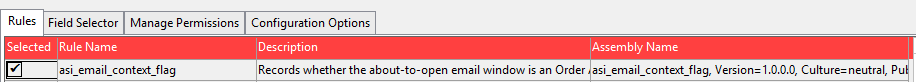

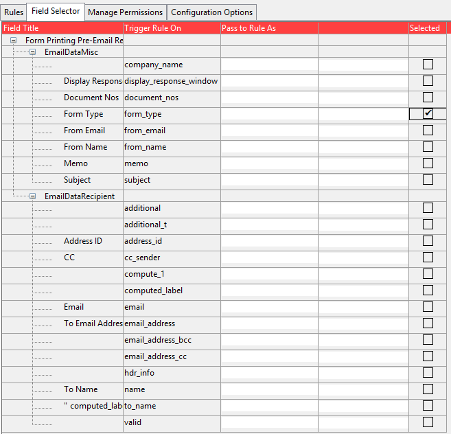

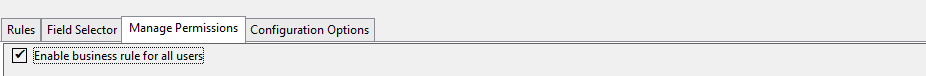

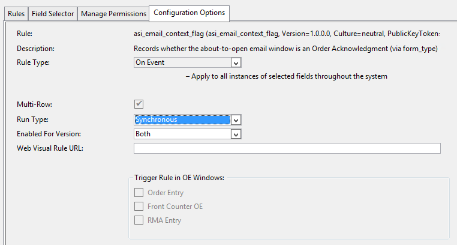

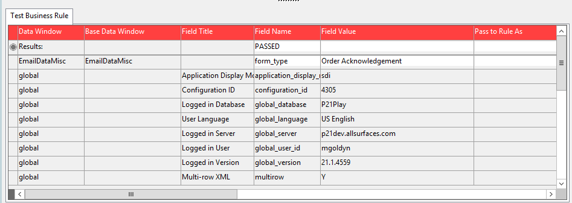

**`asi_oe_email_close_diag` (uid 164 — On-Demand / `cb_ok` on `w_email_response`):**

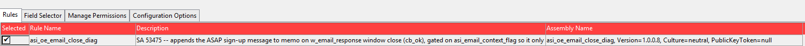

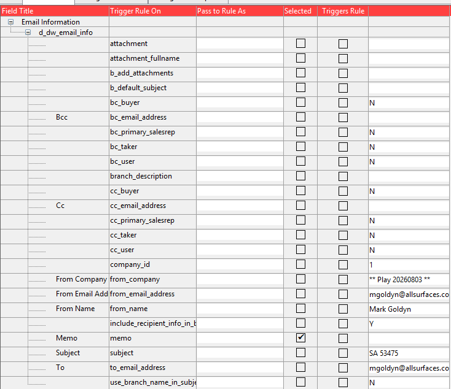

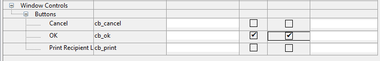

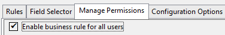

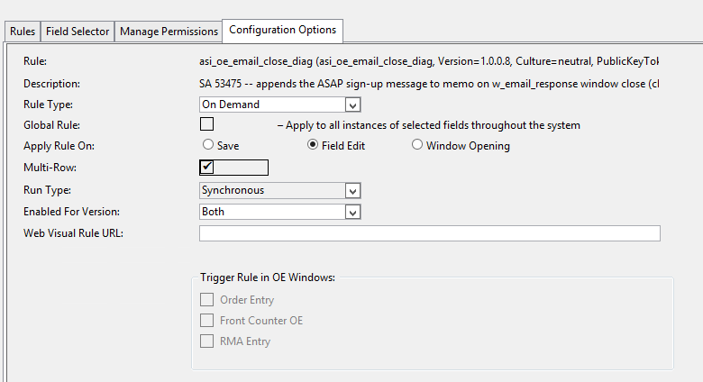

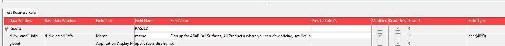

> Note the **Run Type = Synchronous** in d04 and d10 — this matches the unexplained post-refresh state flagged in the 2026-08-10 section above (every prior confirmed-working test was Asynchronous). Re-verify on the next registration cycle.

### Web Rule Manager (P21BusinessRules — older diagnostic version)

**`asi_email_context_flag`:**

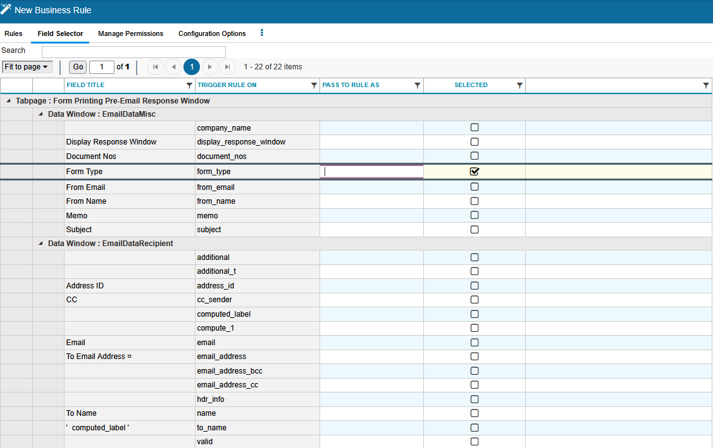

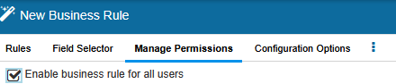

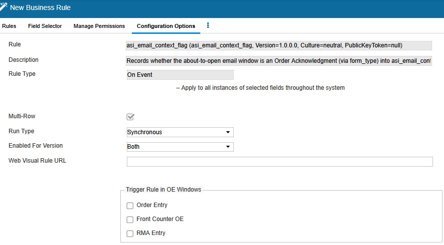

**`asi_oe_email_close_diag`:**

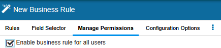

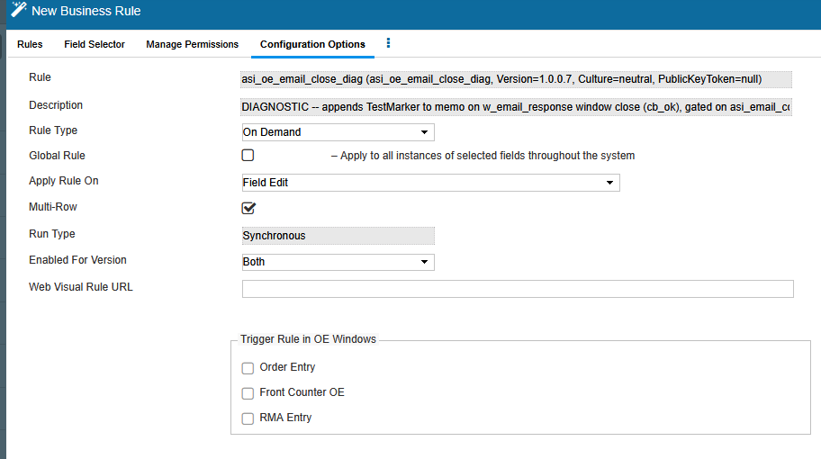

## Dependencies & deploy order
**Preferred design (OK-button, once built for real):**
1. Register as an On-Demand rule attached to window `w_email_response`, trigger control `cb_ok` (Field Selector: Window Controls > Buttons > OK — Selected + Triggers Rule checked).
2. Field Selector: also select `memo` (under `d_dw_email_info`) as Selected (not a trigger).
3. **Must register as Multi-Row = Yes** — required for `Data.Set` access; not editable in place after creation, requires delete+recreate to change.
4. Run Type/Rule Type dropdowns will show/revert to Asynchronous/On Demand regardless of selection for this attach path — expected, not a misconfiguration (the Async label does not mean fire-and-forget here, confirmed via a real delivered-email test).
5. **Before every test, confirm exactly one registration exists.** Delete+recreate cycles (needed whenever Multi-Row changes) leave old registrations behind if not explicitly deleted — two or three live copies attached to the same `cb_ok` button will all fire on one click, producing duplicated text in the email. Hit and fixed 2026-07-30.

**Fallback design (t3, FormPreEmail pre-fill):**
1. Register as an On-Event rule on **Form Printing Pre-Email Response Window** (`FormPreEmail`, `business_rule_event_uid = 24`).
2. Field Selector: under `EmailDataMisc`, select `form_type`, `memo`, `document_nos` (document_nos is log-context only).

No other artifact depends on this or must deploy first — it's a standalone rule either way.

## Backward-compatibility notes
- None — new rule, no prior version in production use.
- **Do not re-register `t1`.** It suppresses the Email Order Acknowledgment window (`display_response_window = "N"`) so the email sends automatically with no human review — this is what caused the 2026-07-28 incident (see below).
- **Do not attempt to attach or embed a file via `attachment`/`attachment_fullname`/`b_add_attachments`.** Confirmed `readOnly="Y"` on all three (2026-07-29); writing to them throws a client-side PowerBuilder error (`Invalid DataWindow row/column specified`) uncatchable from the rule's own code — not a file-path issue, retested with a UNC path with the same result. **Worse, confirmed 2026-07-30:** setting `b_add_attachments = True` specifically triggers a broken `Modify()` retry loop in P21's own `w_email_response` window script (unrelated to our rule) that **crashes the P21 client entirely** — found via a full `business_rule_log` dump showing 4 failed `Modify Expression: attachment_fullname.Visible/.Protect` attempts right before the crash. This is not just a dead end, it's a stability risk — the code has been removed from `asi_oe_email_close_diag.cs` for good. Do not re-add it without a fundamentally different approach (e.g. baking an image into the Crystal Report template instead).
- **`memo` does not render HTML.** Confirmed 2026-07-30 — an `<b>` tag test came through as literal text in the delivered email, not bold. Any future formatting must be plain text.

## ⚠️ Known incident — read before testing again
Testing `t1` in **P21 Business Rules** (`P21BusinessRules` DB) sent the placeholder test message to **4 real customers on real live orders** (Carpet One Inc, JSN Enterprises/My House of Carpets, Turner Ceramic Tile Inc, Carpet Weavers Inc of East Peoria — orders 6032097/6032117/6032208/6032267). Root cause: that database is refreshed from Prod with real customer data and **still has a working outbound SMTP path** — it is not a safe sandbox for email-sending rules by default. Apology emails were sent to all 4 recipients 2026-07-28 — incident response closed.

**Before testing t3 (or any future version):** pick an order where you personally control the recipient email address (edit the To: field in the window before clicking OK), not a live/ecommerce customer order. See `feedback_p21_test_env_live_email.md`.

## Deploy steps
**Not deployed yet — blocked on Matt Munson's answers to two questions (asked 2026-07-30, Outlook draft, awaiting reply): which database to use for UAT, and the exact Marketing text.** Once he answers:
1. Build the real (non-diagnostic) rule from `asi_oe_email_close_diag.cs`'s confirmed-working design: rename off the `_diag` naming, drop the test-marker logic, append Marketing's actual text to `memo` (after the user's existing content, plain text only — HTML is not supported).
2. Register as On-Demand, attached to `cb_ok` on `w_email_response`, Multi-Row = Yes, Field Selector fields per above. Confirm exactly one registration exists before testing.
3. In the database Matt specifies, deregister `t2` (the current active fallback) once the new rule is confirmed working.
4. Build/rebuild the DLL and deploy per the normal Business Rules DLL process for that environment.
5. Before promoting past the UAT database: retest with a controlled recipient, then proceed toward Play.

## Verification
- Print/email an Order Acknowledgment for a controlled test order (recipient set to yourself, never a live/ecommerce order) → confirm:
  - The Email Order Acknowledgment window **displays normally** (not suppressed).
  - The custom message appears in the delivered email's body, after whatever the user typed.
  - `business_rule_log WHERE rule_name = '<real rule name>'` shows the write, and the actual delivered `.msg`/email (check via Outlook, not just the log) contains it — the log alone is not sufficient proof, confirmed 2026-07-29 that a field can show `modifiedFlag=Y` in the log without necessarily being safe to assume delivered (verify the real message every time).
- If using the `t3` fallback instead: confirm `form_type` still matches the literal string `'Order Acknowledgement'` and the memo box opens with blank lines then the message.

## Rollback
- Deregister the rule entirely in P21 Rule Manager (On-Event and On-Demand rules are both additive — removing the registration removes the behavior; no other artifact depends on it).
- Prior file versions (`t1`, `t2`, `t3`) are kept in `CSharp\` for reference/diff only — do not re-register `t1`. Do not attempt to extend the design to attach files via `attachment`/`attachment_fullname`/`b_add_attachments` (confirmed read-only, see above).
